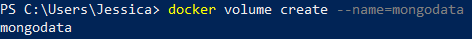
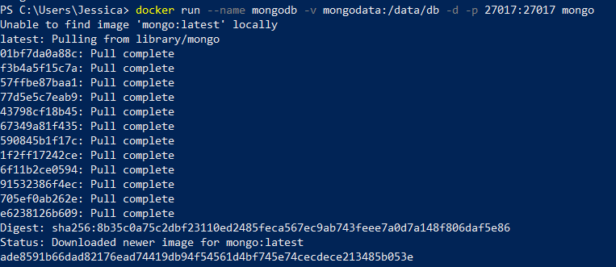
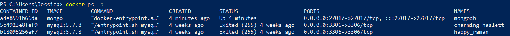
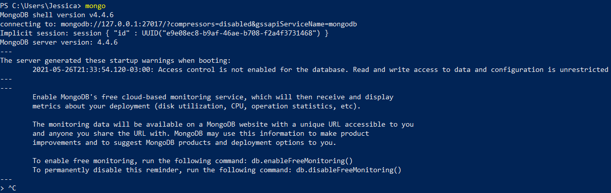

# Índice
* [Tecnologias](#tecnologias)
* [Instalações](#instalações)
* [Setup](#setup)

## Tecnologias
Este projeto foi criado com:
* JavaScript

## Instalações
* Postman
    https://www.postman.com/downloads/
    
* MongoDB
    https://www.mongodb.com/try/download/community

* Docker
    https://docs.docker.com/docker-for-windows/install/
    
#### MongoDB em um container docker

1. Criar volume no docker para persistir dados gerados pelo container

```
docker volume create --name=mongodata
```



2.	Subir docker com imagem do mongodb

```
docker run --name mongodb -v mongodata:/data/db -d -p 27017:27017 mongo
```



3.	Listar containers e *salvar* id do container

```
docker ps -a
```



4.	Rodar container

```
docker start *ContainerID*
```


5.	Acessando mongoDb

```
mongo
```



## Setup
Para executar o projeto, utilize os seguintes comandos:
```
$ npm install
$ npm start
```
http://ec2-3-23-112-58.us-east-2.compute.amazonaws.com:8080/test
