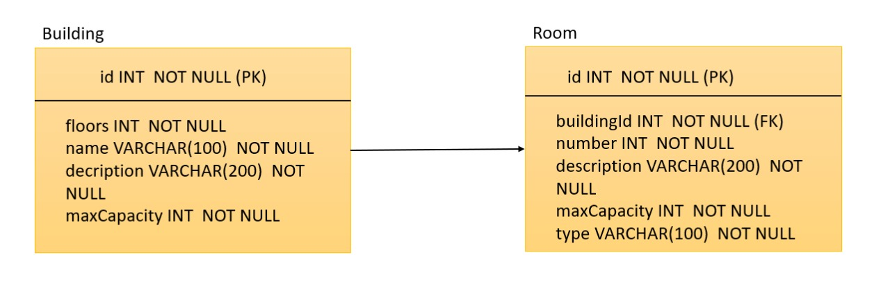

Documentação da API disponível no [SwaggerHub](https://app.swaggerhub.com/apis/biancacamargomachado/building-and-rooms/3.0).

Pré-requisitos:
- NodeJS
- Yarn

Para rodar o projeto local:

```
yarn install
yarn start
```

Para rodar os testes:

```
yarn test
```

## Arquitetura

